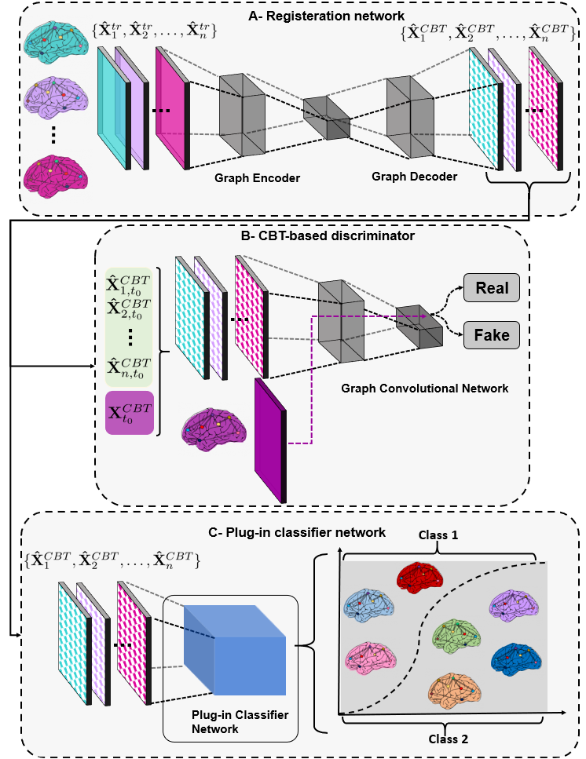
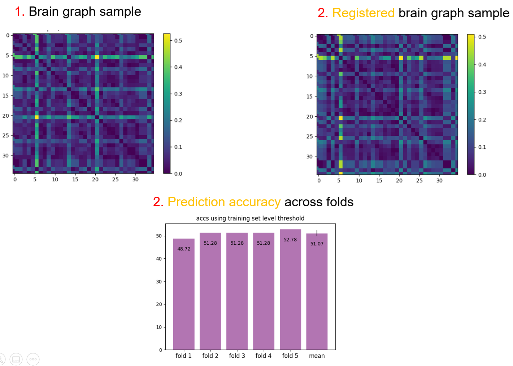

# GRN: Graph Registration Network 
GRN, a graph registration network as a plug-in to conventional GNN classifiers to register graphs into a fixed connectional template for boosting the predictive power of GNN classifiers, coded up in Python
by Zeynep Gürler and Mohammed Amine Gharsallaoui. Please contact zeynepgurler1998@gmail.com for inquiries. Thanks.
 
> **Graph registration network for boosting diagnosis of neurological disorders**
> 
> [Zeynep Gürler](https://github.com/zeynepgurler)<sup>1</sup>, [Mohammed Amine Gharsallaoui](https://basira-lab.com/)<sup>1,2</sup>, [Islem Rekik](https://basira-lab.com/)<sup>1</sup>
> <sup>1</sup>BASIRA Lab, Faculty of Computer and Informatics, Istanbul Technical University, Istanbul, Turkey
> <sup>2</sup>National School for Computer Science (ENSI), Mannouba, Tunisia
>
> **Abstract:** *Deep learning has gained critical importance in the computer-aided diagnosis of neurological disorders. Formerly published methods worked on the data that is driven from medical imaging tools overlooking the complex and internally connected structure of the brain. Brain graphs are excellent representations to explore the biological roadmaps of the human brain. Although there are several conventional graph neural networks (GNNs) for graph classification, these GNNs fail to preserve the complexity and richness of brain connectivity graphs. Therefore, we propose an integrational graph classification framework that is composed of two components respectively, (1) graph registration network (GRN) and (2) a conventional plug-in graph neural network (GNN) to boost diagnosis of neurological disorders. Our GRN is a graph generative adversarial network (gGAN), which registers brain graphs into a fixed brain population template, namely a connectional brain template (CBT) (i.e., a brain template that captures the most common features across a brain graph population) to capture their most discriminative features with respect to the population center while holding their connectional and structural information. Our GRN can be integrated into any GNN working in an end-to-end fashion to boost its prediction accuracy. Our experiments showed that GRN remarkably boosted the prediction accuracy of conventional GNN models.

 
# Detailed proposed framework pipeline
Our framework is a brain graph classification framework based on a graph registration 
architecture comprising a registrator network which learns how to register brain graphs 
into a fixed connectional brain template (CBT). Our learning-based framework comprises 
two key steps. (1) Registration of input graphs into the population CBT, (2) 
Classification of brain graphs with the plug-in GNN using the registered versions 
of the brain graphs. Experimental results against comparison methods demonstrate that our
 framework can achieve the best results in terms of mean prediction accuracy. 
We evaluated GRN on two datasets, where each subject is represented by a morphological
 brain graph. The first dataset (ASD/NC dataset) is collected from the Autism 
 Brain Imaging Data Exchange ABIDE I public dataset (http://fcon_1000.projects.nitrc.org/indi/abide/).
 The second dataset (LMCI/AD dataset) is collected from Alzheimer’s Disease Neuroimaging Initiative 
 (ADNI) database GO public dataset (adni.loni.usc.edu). 

More details can be found at: (link to the paper) and our research paper video on the BASIRA Lab YouTube channel (link). 




# Libraries to preinstall in Python
* [Python 3.8](https://www.python.org/)
* [PyTorch 1.7.0](http://pytorch.org/)
* [Torch-geometric](https://github.com/rusty1s/pytorch_geometric)
* [Torch-sparse](https://github.com/rusty1s/pytorch_sparse)
* [Torch-scatter](https://github.com/rusty1s/pytorch_scatter)
* [Scikit-learn 0.23.0+](https://scikit-learn.org/stable/)
* [Matplotlib 3.1.3+](https://matplotlib.org/)
* [Numpy 1.20.1+](https://numpy.org/)

# Demo

GRN is coded in Python 3.8 on Windows 10. GPU is not needed to run the code.
This code has been slightly modified to be compatible across all PyTorch versions.
main.py is the implementation of the brain graph classification framework proposed
by Graph registration network for boosting diagnosis of neurological disorders 
paper. In this repo, we release the GRN source code trained and tested on a simulated 
data as shown below:

**Data preparation**

We provide a demo code for the usage of GRN for brain graph registration to boost 
the predictive performance of GNN classifiers. In main.py, we train GRN on a 
simulated dataset with 240 subjects which are pre-obtained using dataset.py.
If you need to generate new simulated data with different distribution, you can 
change the mean correlation matrix and connectivity mean values in dataset.py. 

If you want to train GRN on pre-obtained simulated data, 
you can set the GNN type and the model parameters in arg_parse function of 
demo.py and execute,

```bash
python demo.py
```

To run GRN, we generate a fixed connectional brain template using netNorm: 
https://github.com/basiralab/netNorm-PY. 

demo.py generates the following outputs:



# Related References

Network Normalization for Integrating Multi-view Networks (netNorm): Dhifallah, S., Rekik, I., 2020, Estimation of connectional brain templates using selective multi-view network normalization

# arXiv link 

To add.

# Please Cite the Following paper when using GRN:

@article{gurler2020, title={Graph registration network for boosting diagnosis of neurological disorders, <br/>
author={Gurler Zeynep, Gharsallaoui Mohamed Amine, Rekik Islem}, <br/>
journal={Computerized Medical Imaging and Graphics},<br/>
volume={}, <br/>
pages={}, <br/>
year={2022}, <br/>
publisher={Elsevier} <br/>
}<br/>


